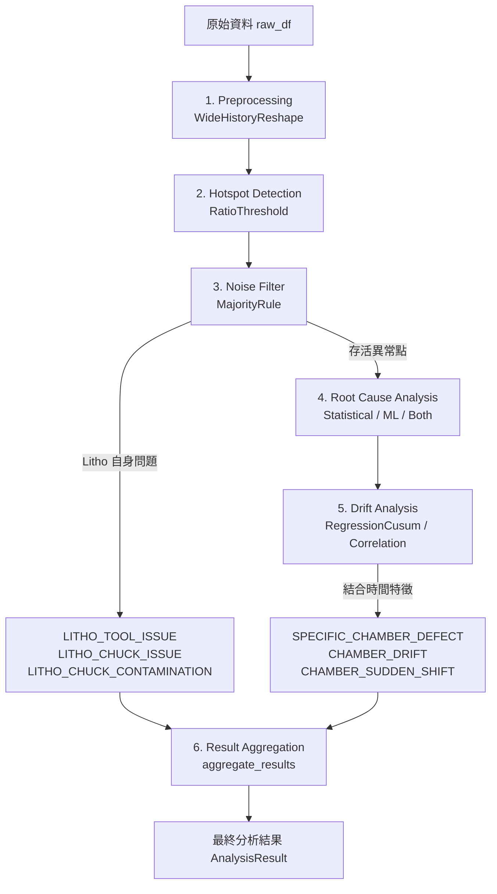

# LITHO-stage NCE 統計與機器學習分析技術解說及合理性評估文件

本文件旨在深入解析 `nce_analysis` 專案中用於非可修正誤差（Non-Correctable Error, NCE）表面平坦度量測異常的**統計分析**與**機器學習（ML）**歸因手法，並對其設計邏輯、數學合理性及潛在的系統性風險進行審查（Review）。

---

## 1. 系統架構與資料流概覽

本專案是一個純 Python 分析套件，負責分析曝光（LITHO）階段的 NCE 異常，定位出最可能負責的上游製程站點/反應腔（CMP, CVD, PVD 等），同時過濾掉由 LITHO 曝光機本身機台或承載台（Chuck）所引起的異常。

整體分析管線（Pipeline）流程如下所示：

各核心模組的對應檔案與類別連結：
- **前處理**：[`WideHistoryReshape`](file:///mnt/c/Users/y4lin/gemini_repo/nce_analysis_service/nce_analysis/preprocessing/wide_history_reshape.py)
- **熱點偵測**：[`RatioThreshold`](file:///mnt/c/Users/y4lin/gemini_repo/nce_analysis_service/nce_analysis/hotspot/ratio_threshold.py)
- **噪音過濾**：[`MajorityRule`](file:///mnt/c/Users/y4lin/gemini_repo/nce_analysis_service/nce_analysis/noise_filter/majority_rule.py)
- **成因分析**：
  - 統計策略：[`StatisticalStrategy`](file:///mnt/c/Users/y4lin/gemini_repo/nce_analysis_service/nce_analysis/root_cause/statistical.py)
  - 機器學習策略：[`MLStrategy`](file:///mnt/c/Users/y4lin/gemini_repo/nce_analysis_service/nce_analysis/root_cause/ml.py)
  - 混合策略：[`BothStrategy`](file:///mnt/c/Users/y4lin/gemini_repo/nce_analysis_service/nce_analysis/root_cause/both.py)
- **漂移與突變分析**：
  - 迴歸與累計和策略：[`RegressionCusum`](file:///mnt/c/Users/y4lin/gemini_repo/nce_analysis_service/nce_analysis/drift/regression_cusum.py)
  - 相關性策略：[`Correlation`](file:///mnt/c/Users/y4lin/gemini_repo/nce_analysis_service/nce_analysis/drift/correlation.py)

---

## 2. 核心分析方法解析

### 2.1 統計分析手法（Statistical Strategy）
統計歸因旨在通過假設檢定，評估特定上游機台/腔體（Suspect Key）與晶圓異常狀態（`is_anomaly`）之間是否存在顯著的統計相關性。

1. **建立列聯表（Contingency Table）**：
   針對每個存活的熱點坐標，統計各上游 suspect key（`Pre_ToolID + Pre_ChamberID`）下的正常與異常晶圓數量，建立一個 $K \times 2$ 的列聯表。
2. **全局獨立性檢定門檻（Global Chi-Square Gate）**：
   - 計算列聯表的期望次數（Expected Frequencies）。
   - 如果**所有**單元格的期望次數皆 $\ge 5$，則進行全局卡方獨立性檢定（Chi-Square Test of Independence）。若全局檢定之 $p\text{-value} \ge \alpha$（預設 0.05），則代表該坐標的異常分佈無顯著規律，直接結束檢定並返回空結果。
3. **費雪精確檢定退避機制（Fisher Fallback）**：
   - 若有**任一**單元格的期望次數 $< 5$，說明樣本稀疏，漸近卡方分佈不再可靠。
   - 此時系統會**跳過全局卡方檢定**，直接對每個機台組合進行「一對多」（One-vs-Rest）的 2x2 費雪精確檢定（Fisher's Exact Test），並在指標中標註 `fisher_fallback = 1.0`。
4. **候選人篩選與信心度**：
   - 使用單尾檢定 `alternative="greater"`，僅關注異常率**顯著升高**（Odds Ratio > 1）的組合，排除異常率降低的保護性機台。
   - 挑選 $p\text{-value}$ 最小且 $< \alpha$ 的 suspect key 作為歸因結果。
   - 信心分數定義為：$\text{Confidence Score} = (1 - p\text{-value}) \times 100$。

### 2.2 機器學習歸因手法（ML Strategy）
機器學習歸因通過建立局部可解釋模型，利用特徵重要性或 SHAP 值來定位異常貢獻度最大的機台。

1. **特徵工程與模型訓練**：
   - 將上游組合 `suspect_key` 進行獨熱編碼（One-Hot Encoding）。
   - 以 `is_anomaly` 為目標標籤，訓練一個淺層決策樹模型 [`DecisionTreeClassifier(max_depth=3)`](file:///mnt/c/Users/y4lin/gemini_repo/nce_analysis_service/nce_analysis/root_cause/ml.py#L32)。
2. **SHAP 值計算**：
   - 利用 `TreeExplainer` 計算每個獨熱特徵對 `is_anomaly = 1` 的 SHAP 值。
   - 由於獨熱特徵具有排他性，單一晶圓僅有一個特徵為 1。對每張晶圓的各特徵 SHAP 值求和，得到該晶圓的預測偏離度 $\sum \phi_i = f(x) - E[f(x)]$。
3. **機台貢獻度排序與信心度**：
   - 依 `suspect_key` 分組，計算各組合下晶圓的預測偏離度平均值（`suspect_means`）。
   - 選擇平均 SHAP 貢獻度最高的機台組合作為嫌疑機台（必須大於 0）。
   - 信心分數定義為：該機台貢獻度佔所有正貢獻度總和的比例。
     $$\text{Confidence Score} = \frac{\text{Mean SHAP}_{\text{best}}}{\sum_{\text{SHAP} > 0} \text{Mean SHAP}} \times 100$$

### 2.3 漂移與突變分析（Drift Analysis - RegressionCusum）
定位嫌疑機台後，利用時間序列分析區分故障型態：

1. **線性迴歸（Gradual Drift）**：
   以機台處理時間 `Pre_Execute_Time` 為自變量（轉換為相對於起點的累計小時數），NCE 測量值為因變量進行線性迴歸。若斜率 $Slope > 0$ 且檢定 $p\text{-value} < \alpha$，判定為漸進式劣化（`CHAMBER_DRIFT`）。
2. **累計和分析（Sudden Shift）**：
   - 對線性迴歸的殘差（Residuals）計算累計和：
     $$C_k = \sum_{j=1}^k (e_j - \bar{e})$$
   - 當累計和的波動範圍 $Range(C) = \max(C) - \min(C)$ 超過門檻值 $5 \times \text{std}(Residuals)$ 時，判定存在突變點（`CHAMBER_SUDDEN_SHIFT`），其優先級高於 Gradual Drift。
3. **靜態偏差（Specific Chamber Defect）**：
   若時間趨勢與突變皆不顯著，則歸類為常態性的局部缺陷（`SPECIFIC_CHAMBER_DEFECT`）。

---

## 3. 分析合理性審查與潛在偏誤分析（Critical Review）

經深入審查專案原始碼與數學邏輯後，發現以下四個核心合理性問題：

### 3.1 CUSUM 突變偵測在高樣本數下的「極高偽陽性率（False Positive Rate）」
在 [`RegressionCusum`](file:///mnt/c/Users/y4lin/gemini_repo/nce_analysis_service/nce_analysis/drift/regression_cusum.py) 中，突變偵測的設計存在嚴重的統計學漏洞：

> [!WARNING]
> **統計漏洞說明**：
> 當製程處於受控狀態（即無任何突變，僅有獨立同分佈的隨機雜訊）時，線性迴歸的殘差 $e_j$ 接近獨立白噪音。
> 此時，其殘差累計和 $C_k = \sum (e_j - \bar{e})$ 在數學上等同於一個**隨機漫步（Random Walk）**或**布朗橋（Brownian Bridge）**。
>
> 隨機漫步的波動範圍（Range）會隨著樣本數 $N$ 的增加而以 $O(\sqrt{N})$ 的速度成長。然而，專案中設定的判定門檻卻是固定的 $5 \times \text{std}(Residuals)$，與 $N$ 無關。
> 這將導致**樣本數越大，判定為突變（`CHAMBER_SUDDEN_SHIFT`）的機率越高，最終趨近於 100%**。

#### 模擬驗證結果：
透過蒙地卡羅模擬（1000次試驗，輸入純白噪音），得到不同樣本數下 CUSUM 的偽陽性率（FPR）：
* **$N = 20$**：偽陽性率為 **24.40%**。
* **$N = 50$**：偽陽性率高達 **95.00%**！

這意味著當我們收集了 50 張晶圓的數據且機台完全正常時，演算法幾乎一定會錯誤回報該機台發生了「突變」（Sudden Shift）。這會導致線上工程師面臨大量虛警。

### 3.2 ML 決策樹深度限制導致的高基數機台「漏檢與定位偏差（Resolution Limit）」
在 [`MLStrategy`](file:///mnt/c/Users/y4lin/gemini_repo/nce_analysis_service/nce_analysis/root_cause/ml.py) 中，決策樹的深度被硬編碼限制為 `max_depth=3`，這在多機台（高基數 categorical）場景下會產生嚴重的偏誤：

> [!CAUTION]
> **決策樹分裂限制**：
> 一棵最大深度為 3 的決策樹，最多隻能擁有 $2^3 - 1 = 7$ 個分裂節點。
> 如果製程環境中存在大於 8 個以上的機台/反應腔體，且其中有複數個機台同時存在不同程度的異常（例如：有 10 個機台的異常率均為 50%，高於基線的 0%）。
> 決策樹在分裂時受限於深度，只能選擇其中 3 到 7 個特徵進行分裂。其餘同樣異常但未被分裂的機台，將被強行歸類到「其他機台」的葉子節點中。
>
> 在 Tree SHAP 計算中，**未被分裂的特徵其 SHAP 值將被計算為 0 或負值**。因此，這些未分裂的異常機台不但不會被辨識出來，反而會獲得負的信心度，造成嚴重的**漏檢（False Negative）**。

#### 模擬驗證結果：
模擬 10 個異常腔體（異常率 50%，樣本各 10）與 40 個正常腔體（異常率 0%，樣本各 10）：
- 決策樹最終僅分裂了其中三個特徵：`ChamberB`, `ChamberJ`, `ChamberD`。
- 其餘 7 個異常腔體（A, C, E, F, G, H, I）的平均 SHAP 貢獻度皆為 **`-0.0255`**。
- `BothStrategy` 中這會導致 ML 歸因與統計歸因產生分歧（例如統計判定 A，ML 判定 B），進而**強行觸發 `Requires_Manual_Review = True`**，使 consensual 機制失效。

### 3.3 ML 中使用 SHAP 的過度工程（Over-engineering）與數學等價性
- 專案中的特徵僅有獨熱編碼後的機台代號，互為排他特徵（沒有任何連續型特徵，也沒有特徵交互作用）。
- 在這種情況下，晶圓的預測值 $f(x)$ 對於特定機台 $i$ 而言是個常數（即該葉子節點的預測機率）。
- 根據 SHAP 的加性可解釋性質， row-wise SHAP 的總和 $\sum \phi = f(x) - E[f(x)]$。因此平均 SHAP 貢獻度 `suspect_means` 在數學上與 `mean_predictions - overall_average` 是完全共線且正相關的。
- 引入決策樹和複雜的 `shap` 函式庫，在沒有其他特徵的情況下，本質上只是對各分組異常率進行了低解析度的非線性逼近（因為樹深度限制了群組數），增加了不必要的計算開銷與依賴庫。

### 3.4 統計分析的多重比較問題（Multiple Testing Problem）
- 統計策略在全局卡方檢定通過（或跳過）後，會對所有機台進行「一對多」的費雪精確檢定。
- 如果機台數量較多（例如有 20 個腔體），在顯著水準 $\alpha = 0.05$ 下，即使所有腔體均正常，進行 20 次獨立檢定時，至少出現一次偽陽性顯著的機率（Family-Wise Error Rate）為 $1 - (1 - 0.05)^{20} \approx 64.15\%$。
- 專案中沒有對事後檢定（Post-hoc Fisher's tests）進行任何多重比較修正（如 Bonferroni 或 Benjamini-Hochberg FDR 修正），使得單次分析在機台數量多時，偽陽性率上升。

---

## 4. 具體改進建議（Recommendations）

為在不改動現有架構的情況下（遵守禁止修改程式碼之要求），建議未來版本迭代時導入以下優化方案：

### 4.1 CUSUM 突變偵測優化
將靜態門檻值修改為動態門檻或標準 SPC 雙向 CUSUM 演算法：
- **動態門檻**：將門檻值與樣本數 $N$ 掛鉤，例如調整為 $3 \times \text{std}(Residuals) \times \sqrt{N}$，以抵消隨機漫步的擴散效應。
- **標準 SPC CUSUM**：
  引入寬限值 $k$（通常為 $0.5 \sigma$）限制微小擾動的累積：
  $$S_H(t) = \max(0, S_H(t-1) + z_t - k)$$
  並在 $S_H(t) > h$（通常 $h=4$ 或 $5$）時報警。由於有 $-k$ 的存在，受控狀態下的累積和具有負向漂移，其偽陽性率不會隨 $N$ 無限增長。

### 4.2 ML 策略的替代與增強
- **特徵交互作用**：若維持決策樹架構，應在特徵中加入 `PartID`、`ChuckID` 或實際製程參數，使其發揮決策樹能捕捉交互作用的優勢。
- **正則化邏輯迴歸（L1 Regularized Logistic Regression）**：
  若特徵依然僅為純機台類別，建議改用 Lasso 邏輯迴歸。Lasso 能同時對所有類別進行篩選，且沒有深度限制，不會因為基數過高而漏檢異常腔體。
- **動態調整樹深度**：若維持決策樹，應根據輸入類別基數 $K$，動態設定 `max_depth = ceil(log2(K))`，確保所有機台都有機會被分裂。

### 4.3 統計策略的多重比較修正
- 在 [`StatisticalStrategy`](file:///mnt/c/Users/y4lin/gemini_repo/nce_analysis_service/nce_analysis/root_cause/statistical.py) 中，對個別費雪檢定的 $p\text{-value}$ 進行 **Holm-Bonferroni** 或 **Benjamini-Hochberg** 修正，以確保在多機台環境下的統計嚴謹性，降低虛警機率。
